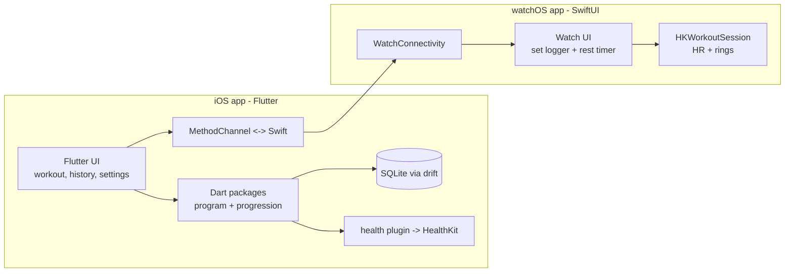
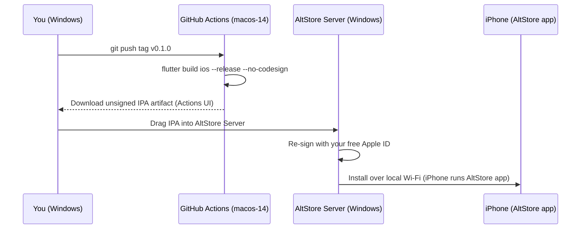
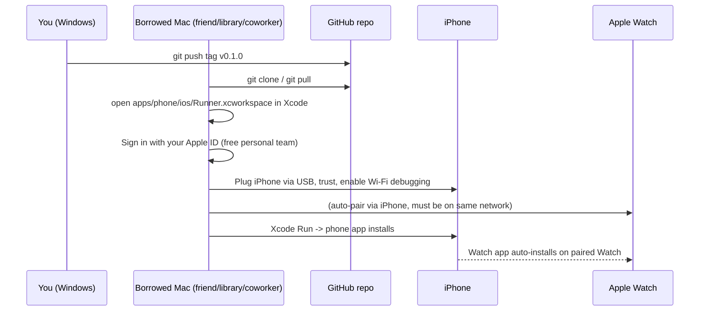
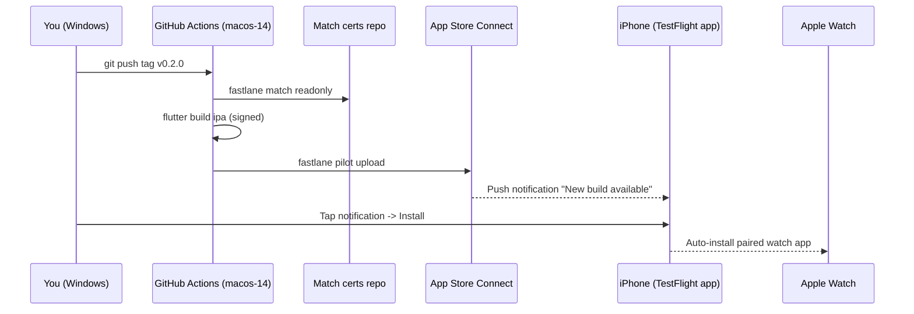

# MennoTracker — StrongLifts-style tracker for Galpin/Henselmans hypertrophy program

## Problem

Build a StrongLifts-clone tracker for the Andy Galpin × Menno Henselmans 8-week ABAB
hypertrophy program — **reduced version only** for v1. Mechanics (set-by-set logging,
rest timer with haptics, plate math, weight-progression suggestions, history/graphs)
should feel like StrongLifts 5×5, but the progression model is \*\*rep-range
autoregulation\*\*, not linear loading.

Must ship to **iOS + Apple Watch**, integrate with **HealthKit**, and be developed from a
**Windows machine** where macOS-only work runs on cloud CI (GitHub Actions macOS runner).

The official-version program data structure remains supported by the data model, but only
the reduced variant is encoded and exposed in v1. Adding the official version later is a
pure data addition, no code change.

## Constraints that shape the design

- **No $99 Apple Developer Program for v1.** Build everything; surface what works,
  gracefully degrade what doesn't, and lay the rails so flipping to the paid program
  later is a CI-config change with zero code edits.
- **AltStore on Windows is the primary install path** for the phone. The phone app is
  fully usable that way.
- **Watch app installs via a borrowed Mac running Xcode**, on a 7-day cycle. The watch
  app is built and bundled in the same IPA either way; only the *delivery* requires
  borrowed Mac access until enrollment.
- **HealthKit is runtime-degraded by default.** Code paths exist; iOS may or may not
  grant the entitlement under free signing depending on the install path. The app
  surfaces availability state in Settings and no-ops Health writes when not granted.
- **watchOS binaries can only be produced by Xcode on macOS.** No stack avoids this.
  Flutter / React Native / MAUI all hand off to Xcode at the end.
- **Cloud Mac minutes cost real money.** Every iOS/watchOS build burns \~5–15 macOS minutes.
  GitHub Actions counts macOS at 10× the Linux rate. Therefore: minimize the number of
  cloud builds, and maximize how much work can be done locally on Windows for free.
- **Local Windows dev gives no iOS simulator and no SwiftUI preview.** Any iOS-UI work
  done in pure Swift can only be visually verified via a cloud build → AltStore install
  (or borrowed-Mac install for the watch).

## Stack decision: Flutter (iOS) + Native Swift (watchOS) + Dart-shared logic

Rationale:

- **Phone-side dev loop on Windows is free and fast.** Flutter UI, business logic,
  persistence, and the progression engine all run on the Android emulator locally with
  hot reload. macOS minutes are only burned when cutting an installable build.
- **Watch app stays native Swift/SwiftUI**, because it is the hot path during a workout
  (timers, HR, haptics, `HKWorkoutSession`) and bridging that through Flutter would be
  fragile. Watch app is deliberately kept small and stable to minimize churn.
- **Pure-Dart `program` and `progression` packages** hold the program definition and the
  autoregulation engine, with unit tests that run on Windows in milliseconds. This is
  the part that will iterate most often, so we want it off the macOS runner entirely.
- **HealthKit access** on iOS via the `health` plugin (workout writes, energy, HR
  summary). Watch-side live `HKWorkoutSession` stays in Swift where it belongs.

Trade-off accepted: the phone↔watch boundary requires a `MethodChannel` + a thin Swift
bridge using `WatchConnectivity`. This is plumbing, not architecture risk.

When the user eventually buys a Mac or enrolls in $99, nothing about this design has
to change — local Xcode replaces borrowed-Mac for watch installs, and TestFlight lanes
flip from dormant to active for headless phone installs.

## High-level architecture



Data ownership: phone is source of truth (program definition, full history, settings).
Watch holds only the in-flight workout payload and streams set completions back to the
phone via `WatchConnectivity` (`transferUserInfo` for reliability + `sendMessage` for
live UI). If the watch is used standalone (phone in locker), pending sets queue locally
and flush when reachable.

## Repository layout

```text
MennoTracker/
  apps/
    phone/                       # Flutter iOS+Android app (Android target = Windows dev loop)
      lib/
      ios/
        Runner.xcworkspace
        Runner/                  # iOS Flutter shell + Swift bridge
        MennoWatch/              # WatchKit App target (SwiftUI sources) - lives here
        MennoWatchTests/         # so it's bundled into the same IPA as the phone app
      android/
      test/
  packages/
    program/                     # Pure Dart: program definition (workouts A/B, exercises)
    progression/                 # Pure Dart: autoregulation engine + unit tests
    shared_models/               # Pure Dart: WorkoutSession, SetLog, ExerciseState, JSON codecs
  ci/
    fastlane/                    # Lanes: ios unsigned (active), ios beta + ios adhoc (dormant)
    scripts/
  .github/workflows/
    dart-ci.yml                  # Linux runner: dart analyze + test for packages/*, flutter test
    ios-unsigned.yml             # macOS runner: PRIMARY - produces unsigned IPA artifact for AltStore
    ios-beta.yml                 # macOS runner: DORMANT - flip on after $99 enrollment
    ios-adhoc.yml                # macOS runner: DORMANT - flip on after $99 enrollment
  docs/
    program.md                   # Reduced program spec, copied from the source chat
    altstore-setup.md            # Step-by-step AltStore Server + iPhone pairing on Windows
    installing-watch-app.md      # Borrowed-Mac workflow for the watch app, 7-day cycle
    migrate-to-paid-program.md   # Exact flip-the-switch instructions when enrolling
```

Why the watch target lives inside `apps/phone/ios/` rather than a separate `apps/watch/`
project: WatchKit App targets nested inside the iOS app's Xcode project produce a single
IPA that contains both binaries (`Payload/Runner.app/Watch/MennoWatch.app`). That's the
only layout that supports paired auto-install once $99 enrollment unlocks it, and it's
also what Xcode-on-borrowed-Mac expects when installing the watch component for v1.

The phone <-> watch JSON contract is defined once in `shared_models` (Dart) and mirrored
by hand in a small `WatchPayload.swift` file inside `apps/phone/ios/MennoWatch/`. Schema
is versioned and tiny, so drift is manageable; can be replaced with code generation later
if it becomes a pain point.

## Programs (v1 ships reduced only)

The reduced variant from the source chat. Encoded as a single `Program` constant.

### Reduced Workout A (16–17 work sets, \~55–65 min)

| Exercise | Sets | Reps | Rest |
| --- | ---: | ---: | ---: |
| Romanian deadlift | 3 | 8–12 | 2.5–3 min |
| Leg extension | 3 | 8–12 | 2–3 min |
| Barbell bench press | 3 | 6–10 | 2.5–3 min |
| Neutral-grip pulldown | 3 | 8–12 | 2–3 min |
| Seated calf raise | 2–3 | 8–12 | 1.5–2 min |
| Cable lateral raise | 2 | 8–12 | 1.5–2 min |

### Reduced Workout B (19 work sets, \~60–70 min)

| Exercise | Sets | Reps | Rest |
| --- | ---: | ---: | ---: |
| High-bar squat | 3 | 5–8 | 3 min |
| Lying leg curl | 3 | 8–12 | 2–3 min |
| Barbell overhead press | 3 | 6–10 | 2.5–3 min |
| Seated row | 3 | 8–12 | 2–3 min |
| Cable chest fly / pec deck | 3 | 6–10 | 1.5–2.5 min |
| Triceps pushdown | 2 | 8–12 | 1.5–2 min |
| Seated dumbbell curl | 2 | 8–12 | 1.5–2 min |

Schedule pattern: `[A, B, A, B]` over 4 days/week (e.g. Mon/Tue/Thu/Fri).

## Data model

- `Program { id, name, weeks, schedulePattern: [A,B,A,B], workouts: [Workout] }`
- `Workout { id, name, blocks: [ExerciseBlock] }`
- `ExerciseBlock { exerciseId, sets, repMin, repMax, restSeconds, equipmentHint }`
- `Exercise { id, name, category, defaultIncrementKg, smallestPlatePairKg, isBarbell }`
- `WorkoutSession { id, programId, workoutId, dateUtc, startedAt, completedAt?, entries: [ExerciseEntry] }`
- `ExerciseEntry { blockId, workingWeightKg, sets: [SetLog], suggestionApplied? }`
- `SetLog { targetReps: (min,max), actualReps, rpe?, completedAt }`
- `ExerciseState { exerciseId, currentWorkingWeightKg, lastUpdatedAt, history: [WeightChange] }`
  (Per-exercise rolling weight, updated by the progression engine.)

Persistence on phone: **drift** (SQLite). Migrations from day 1. Watch keeps the
in-flight session in memory and syncs deltas on every set; full session record is owned
by the phone.

## Progression engine (the heart of the app)

Pure Dart, fully unit tested, no Flutter dependency. Implements the autoregulation rules
from the source chat:

- For each top set of an exercise, compute `effectiveTopReps` from the first hard set
  (ignoring deliberate warmups marked as such).
- **Rep-range thresholds for weight increase** (configurable, defaults below):
    - Range 5–8 → increase when top set hits 9–10 clean reps.
    - Range 6–10 → increase when top set hits 11–12 clean reps.
    - Range 8–12 → increase when top set hits 13–14 clean reps.
- **Increment**: \~2.5 % of current working weight, snapped up to the smallest available
  plate pair (`Exercise.smallestPlatePairKg`, default 2.5 kg barbell / 1 kg dumbbell /
  one-pin machine).
- **Deload rule**: if any non-first set drops below `repMin`, suggest reducing the
  remaining sets in *this* workout by \~10 %, and if the same exercise misses again next
  session, drop the persisted working weight by 10 %.
- **Session-level suggestion**: at workout start, the engine recommends a working weight
  per exercise based on `ExerciseState` + last session outcome. User can override; the
  override is what gets persisted as the new `currentWorkingWeightKg`.
- All thresholds, increment %, and deload % are exposed in Settings so the user can
  tweak without code changes.

Tests cover: increment threshold boundary cases, deload trigger, smallest-plate snapping,
mixed-set behaviour (one good set + bad later set), and resume-after-skipped-session.

## Phone app (Flutter) — screens

1. **Today** — shows next scheduled workout (A or B based on history), planned exercises,
   each with suggested working weight and target sets/reps.
2. **Workout in progress** — exercise-by-exercise flow, set logger, **rest timer** with
   foreground notification + audible chime + sends `WKHapticType.notification` to the
   watch via the bridge (when watch is paired & reachable). Quick +/- for reps,
   long-press to mark as failed/partial set. Plate calculator overlay (visualizes
   plates per side for the entered weight).
3. **History** — chronological session list, per-exercise weight & rep trend charts
   (using `fl_chart`), PR markers.
4. **Settings** — units (kg/lb), plate inventory, rest timer behaviour, HealthKit
   permission + availability indicator, progression thresholds, watch app reachability
   test, program selector.

State management: Riverpod (chosen for testability; the progression engine and DB
repositories are exposed as providers and easily mocked).

## Watch app (native Swift / SwiftUI) — screens

Designed to be small, stable, and rarely iterated on. Bundled in the IPA but only
delivered to the wrist via Xcode-on-borrowed-Mac for v1 (see distribution section).

1. **Idle / "Start today's workout"** — receives the planned workout from the phone;
   if none cached, shows "Open MennoTracker on iPhone".
2. **Set logger** — current exercise name, working weight, target reps range, big rep
   number adjusted by Digital Crown, **Done Set** button → haptic, rest timer starts.
3. **Rest timer** — large countdown, double-tap to skip, prominent haptic at 10 s and 0 s.
4. **Workout summary** — total time, sets done, HR avg/max (when HealthKit available),
   then "Send to iPhone".

`HKWorkoutSession` is wrapped behind a feature flag tied to runtime HealthKit
availability. When granted: traditional strength training session runs for the workout
duration, HR + activity rings stay live, single `HKWorkout` written at completion.
When not granted: the workout still tracks time and sets, summary shows a "HealthKit
unavailable" badge, no Health writes attempted.

WatchConnectivity:

- Phone → Watch: `transferUserInfo` with today's `WorkoutPayload` JSON when the user
  taps "Start" on the phone (or at app launch on watch if the workout already started).
- Watch → Phone: `transferUserInfo` per completed `SetLog`; `sendMessage` for live UI
  mirroring when both are foreground.
- Reachability fallback: queue locally; flush on next reachable event.

## HealthKit integration (designed for graceful degradation)

The app is built with full HealthKit support but \*\*must function completely when the
entitlement isn't granted\*\* — which is the default state under free signing.

### Runtime detection

At app launch and on entering Settings, the app probes:

1. `HKHealthStore.isHealthDataAvailable()` — returns false in Simulator / on iPad,
   true on iPhone/Watch.
2. `requestAuthorization` for the workout-write types.
3. Result is persisted in a `HealthKitAvailability` enum: `available`, `denied`,
   `notRequested`, `notEntitled` (the case under free signing where the OS rejects
   the entitlement request entirely).

Settings screen surfaces this state explicitly: "HealthKit: available" or "HealthKit:
not available — Apple Developer Program required". Degraded-mode operation is obvious
to the user, not a silent bug.

### Reads (with permission)

- Bodyweight (for plate-relative tracking later)
- Resting HR (informational on Today screen)

### Writes (with permission)

- One `HKWorkout` per session: `activityType = .traditionalStrengthTraining`,
  start/end, energy estimate, average HR, metadata containing exercise list + total
  sets. Watch writes via `HKWorkoutSession` end; phone-only sessions write via the
  `health` plugin.

### What happens without the entitlement

- All HealthKit calls return failure cleanly. No crashes, no spinners.
- The workout-completion path still saves the session to local SQLite.
- HR / activity ring display on the watch is replaced by a "HealthKit unavailable"
  badge in the workout summary; everything else works.
- When the user enrolls in $99 and reinstalls, the next workout transparently starts
  writing to Health with no code change or user action required.

## Build & release pipeline (Windows-friendly, cost-aware)

Built around one principle: **macOS minutes are scarce, Linux minutes are free.**
Everything that *can* run on Linux runs on Linux; macOS runners only execute for builds
you actually want to install.

### macOS runner setup — concrete details

- `runs-on: macos-14` — Apple Silicon (M-series), Xcode 15.x pre-installed, \~2× faster
  than the older Intel `macos-13` runners. Re-pin to `macos-15` once it's stable in CI.
- **Billing**: macOS minutes are 10× Linux. On a private repo, a typical 8-minute
  Flutter iOS archive consumes 80 effective minutes from the free tier (2000/month for
  personal, 3000 for Pro). On a public repo, **macOS minutes are free with no cap**,
  which is a serious lever (see "Going public" below).
- **Xcode action**: `maxim-lobanov/setup-xcode@v1` with `xcode-version: '15.4'`. Avoid
  `latest-stable` because it can shift mid-stream and break reproducibility.
- **Flutter install**: `subosito/flutter-action@v2` with `channel: stable` and a pinned
  `flutter-version`.
- **CocoaPods cache**: `actions/cache@v4` keyed on `Podfile.lock` hash; saves \~3 min/build.
- **DerivedData cache**: keyed on `xcodeproj` + Swift source hashes; saves \~2 min/build.
- **Pub cache**: `actions/cache@v4` keyed on `pubspec.lock`.

### Active workflow: `ios-unsigned.yml` (the only macOS workflow that runs by default)

```yaml
name: iOS Unsigned IPA (for AltStore)
on:
  workflow_dispatch:
  push:
    tags: ['v*']
jobs:
  build:
    runs-on: macos-14
    timeout-minutes: 30
    steps:
      - uses: actions/checkout@v4
      - uses: maxim-lobanov/setup-xcode@v1
        with: { xcode-version: '15.4' }
      - uses: subosito/flutter-action@v2
        with: { channel: stable, flutter-version: '3.24.x', cache: true }
      - uses: actions/cache@v4
        with:
          path: apps/phone/ios/Pods
          key: pods-${{ hashFiles('apps/phone/ios/Podfile.lock') }}
      - run: flutter pub get
        working-directory: apps/phone
      - run: cd apps/phone/ios && pod install --repo-update
      - run: flutter build ios --release --no-codesign
        working-directory: apps/phone
      - name: Package unsigned IPA
        run: |
          cd apps/phone/build/ios/iphoneos
          mkdir Payload
          mv Runner.app Payload/
          zip -r MennoTracker.ipa Payload
      - uses: actions/upload-artifact@v4
        with:
          name: MennoTracker-unsigned-ipa
          path: apps/phone/build/ios/iphoneos/MennoTracker.ipa
          retention-days: 30
```

You download the artifact from the Actions run summary on Windows, drop it into
AltStore Server, and it pushes to your phone.

### Dormant workflows (file-present, no secrets, flip-on after $99)

- `ios-beta.yml` — TestFlight lane. Same shape as the unsigned workflow but adds
  `fastlane match readonly` for cert fetch, `build_app` for signed build, and
  `upload_to_testflight`. Documented at the top of the file with a comment block:
  "REQUIRES $99 ENROLLMENT. See docs/migrate-to-paid-program.md."
- `ios-adhoc.yml` — Ad-hoc OTA via Firebase App Distribution. Same shape but with
  ad-hoc export options + Firebase upload step. Same dormant comment.

Both files are committed and version-controlled so they evolve with the codebase, but
they will fail loudly if triggered without the secrets in place, which is fine — they're
not meant to be run yet.

### Fastlane setup (lives in `ci/fastlane/`, structure-only for v1)

`Matchfile`, `Appfile`, and a `Fastfile` with three lanes (`ios beta`, `ios adhoc`, and
a placeholder `ios bootstrap`) are all present in the repo. The Matchfile and Appfile
have placeholder values; nothing actually runs until the user enrolls. This avoids the
"I need to set up fastlane from scratch" cost when the time comes — it's already wired.

### CI workflows (final list)

- `dart-ci.yml` — Ubuntu, **every push**, free:
  `dart analyze`, `dart test packages/...`, `flutter test apps/phone`. Catches 90 % of
  bugs without touching macOS.
- `ios-unsigned.yml` — macOS, **manual + tag-only**, active. Primary v1 path.
- `ios-beta.yml` — macOS, **dormant** until enrollment.
- `ios-adhoc.yml` — macOS, **dormant** until enrollment.

### Cost guardrails

- All Dart/Flutter unit + widget tests run on Linux runners (free at scale).
- macOS workflows are `workflow_dispatch` + tag-only; **never on every push**.
- `timeout-minutes: 30` on macOS jobs hard-caps any runaway build.
- Cache CocoaPods + DerivedData + pub between runs.
- **Going public**: a public repo gets **unlimited free macOS minutes**. The program
  data is already public, the engine is generic, and the secrets we'd use (App Store
  API key, etc.) live in encrypted Actions secrets either way. Recommended unless
  there's a specific reason not to.

## Distribution & device installation — v1 reality + migration path

### Primary v1 flow: AltStore on Windows → iPhone



One-time setup (\~30 minutes):

1. Install **iTunes (non-Microsoft-Store version) + iCloud for Windows** — AltStore
   depends on Apple's pairing services that ship with these.
2. Install **AltStore Server** on Windows from altstore.io.
3. Connect iPhone via USB; in AltStore Server, click "Install AltStore on device";
   enter your Apple ID. Trust the certificate in iPhone Settings → General → VPN &
   Device Management.
4. Pair Mail account in AltStore Server (used for push notifications when refresh is
   needed).
5. Enable Wi-Fi sync in iTunes for the iPhone; now AltStore can talk wirelessly.

Per-build flow (after one-time setup):

1. Tag a release. GH Actions builds the unsigned IPA. \~8–10 min.
2. Download the IPA from the Actions run summary on your Windows PC.
3. Open AltStore Server, drag the IPA in, select your iPhone. It re-signs and pushes.
4. Phone app appears on the iPhone Home Screen. Done.

Refresh: AltStore can auto-refresh installed apps every \~6 days as long as your PC is
on the same Wi-Fi as the phone and AltStore Server is running. Manual refresh is a
two-tap operation in the AltStore app.

**What this does NOT do**: install the watch component. The watch app exists inside
the IPA but free-signing entitlements don't allow the paired auto-install flow. See
next section.

### Watch app delivery for v1: borrowed-Mac via Xcode



One-time setup:

1. Spend \~45 min on a borrowed Mac to: install Xcode, sign in with your Apple ID
   (no $99 needed), clone the repo, open `apps/phone/ios/Runner.xcworkspace`.
2. Plug iPhone in via USB, trust the Mac, enable wireless debugging
   (Xcode → Window → Devices and Simulators → check "Connect via network" for both
   iPhone and the paired Watch).
3. Manually set the team to your personal team for all three targets (Runner,
   MennoWatch, MennoWatchTests) in Xcode's "Signing & Capabilities" tab.

Per-install flow (every \~7 days, since free signing expires):

1. `git pull` on the Mac.
2. In Xcode, select your iPhone as the run destination and press ⌘R.
3. Phone app installs; **watch app auto-installs on the paired Watch** as long as
   "Automatic Install" is on in the iPhone's Watch app settings.

What this gives you that AltStore can't:

- Watch app actually reaches the wrist.
- HealthKit entitlement works on real device (free personal team + Xcode install path
  does grant HealthKit, per Apple's developer docs).

What it costs:

- A Mac on the same Wi-Fi as your iPhone, once every 7 days.
- \~10 minutes of borrowed-Mac time per install.

If you don't want to do the 7-day Mac dance, the watch app simply sits dormant in the
IPA. The phone app via AltStore still gives you the full StrongLifts-clone experience
(set logging, rest timer with phone haptics, plate calc, history) — just without the
on-wrist ergonomics.

### Apple's signing tiers (for context)

| Capability | Free Apple ID ("personal team") | Apple Developer Program ($99/yr) |
| --- | --- | --- |
| Install iOS app on own device via Xcode | ✅ | ✅ |
| Install iOS app via AltStore | ✅ | ✅ |
| **Install paired watch app** | ✅ via Xcode only | ✅ via Xcode, TestFlight, or ad-hoc |
| **HealthKit on real device via Xcode** | ✅ (personal team grant) | ✅ |
| **HealthKit on real device via AltStore** | ⚠️ flaky (entitlement may be stripped on re-sign) | ✅ |
| TestFlight (no-Mac install) | ❌ | ✅ |
| Provisioning expiry | **7 days** — re-install via Xcode | **TestFlight: 90 days** / **ad-hoc: 12 months** |

### Dormant migration paths (kept ready for $99 enrollment)

When/if the $99 enrollment happens, the migration is a single command + secret-set,
documented in `docs/migrate-to-paid-program.md`:

1. **Bootstrap fastlane match** on a borrowed Mac or Codemagic free tier:
   `bundle exec fastlane ios bootstrap` — creates the encrypted certs repo.
2. **Add 5 GitHub Actions secrets**: `MATCH_PASSWORD`, `MATCH_GIT_BASIC_AUTHORIZATION`,
   `APP_STORE_CONNECT_API_KEY_BASE64`, `APP_STORE_CONNECT_API_KEY_ID`,
   `APP_STORE_CONNECT_API_ISSUER_ID`.
3. **Update one config flag** in `ios-beta.yml` and `ios-adhoc.yml` to remove the
   `# DORMANT` guard and enable the dispatch trigger.
4. **Tag a release**. Builds upload to TestFlight or Firebase App Distribution.
5. **Install via TestFlight** on your iPhone (one-time invite); watch app
   auto-installs on the paired Watch. No more Mac borrowing.

#### Path A.1 — TestFlight (post-enrollment recommended)



90-day install validity per build; CI tag push silently refreshes the clock. No Mac
required on your side ever.

#### Path A.2 — Ad-hoc OTA via Firebase App Distribution (post-enrollment alternative)

12-month profile validity. You open a Safari link on iPhone, tap "Install" — skip
TestFlight processing entirely. Best for "I want the fastest possible install loop
after enrollment, even faster than TestFlight."

### Summary: which delivery path for which goal

| Goal | Path |
| --- | --- |
| Daily use of phone app on Windows, no $99 | **AltStore (primary v1)** |
| Get the watch app on your wrist, no $99 | **Borrowed Mac + Xcode** (7-day cycle) |
| Daily use of phone + watch + HealthKit, $99 paid | Path A.1 TestFlight |
| Skip TestFlight wait after $99 | Path A.2 ad-hoc OTA |
| Share with friends/family | Path A.1 TestFlight invites |

## Watch dev iteration strategy

- Build the watch UI in one focused pass against a JSON fixture so it's "done" before
  the phone bridge exists.
- Use `xcodebuild test` on the watch target in CI for logic changes — runs in the
  iOS workflow's leftover time, no extra macOS minutes.
- Keep the watch payload format stable; version it. Backwards-compatible additions only.
- Manual cloud builds via `workflow_dispatch` — never automatic on push.

## Out of scope (initial release)

- **Official-version program** — only the reduced variant ships in v1. Data model
  supports it; adding the official tables later is a pure data addition.
- Android app (Flutter supports it but the watch story is Android Wear, which is a
  different code path; revisit later if useful).
- Custom user-defined programs (data model supports it; UI later).
- Cloud sync across devices (HealthKit covers cross-device workout history;
  full custom sync via CloudKit is a v2).
- Apple Watch standalone install without paired iPhone (requires significant extra
  watchOS work; v2).

## UI/UX reference material

Comprehensive StrongLifts 5×5 UI research saved in the session artifacts folder
(not committed to repo). When implementing UI screens, consult:

```
C:\Users\samvidmistry\.copilot\session-state\86420b9f-88e2-4ff3-a8c2-61158994af78\
  files\stronglifts-research\
    ui-spec.md           # Every screen described with layout, colors, interactions
    mechanics-spec.md    # Set logging, rest timer, progression, deload, HealthKit behavior
    design-tokens.md     # Color palette, typography, spacing, component shapes
    comparables.md       # Strong, Hevy, FitNotes notes for design space context
    screenshots/
      iphone/            # 24 PNGs - App Store + support doc screenshots
      watch/             # 11 PNGs - all key Apple Watch screens
    download-screenshots.ps1   # Re-download script if needed
```

The goal is StrongLifts-equivalent mechanics with the Galpin/Henselmans program data.
MennoTracker should feel familiar to anyone who has used StrongLifts — same set-circle
metaphor, same rest-timer flow, same plate calculator — but with rep-range
autoregulation instead of fixed 5×5 linear progression.

## Todos (high level)

Tracked in SQL in `todos`. Dependencies in `todo_deps`.